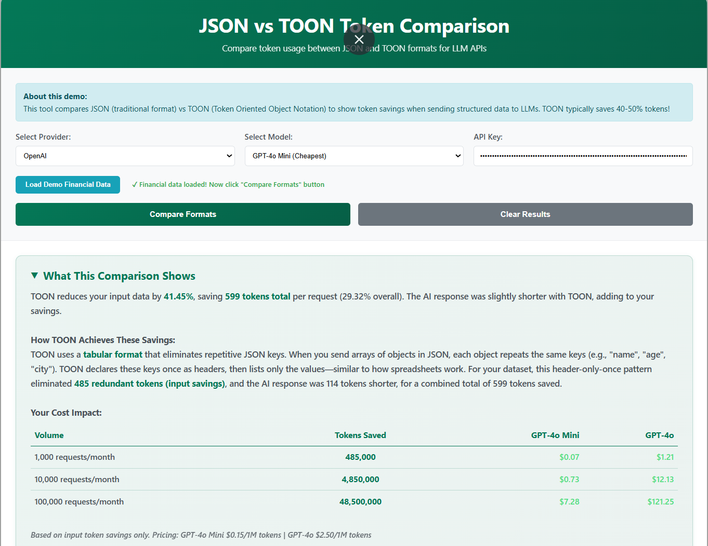

# TOON vs JSON Token Comparison Tool

[](https://ganapap1.github.io/toon-json-token-comparison/)
[](https://opensource.org/licenses/MIT)

A powerful interactive web tool that demonstrates token efficiency differences between JSON and TOON (Token Oriented Object Notation) formats when sending financial statements, calculated ratios, and structured data to Large Language Models (LLMs) for analysis.



## 💡 Why This Matters for Financial Analysis

When you send financial statements with calculated ratios to AI (GPT-4, Claude, Gemini) for analysis, **you're paying for every token**. JSON format repeats keys like "Total Revenue", "Gross Profit", "Current Ratio" for every single data point.

**TOON eliminates this repetition**, saving you **30-50% on input tokens**—directly reducing your AI API costs without changing your application logic.

Perfect for:
- 🏦 Financial institutions analyzing multiple companies
- 📊 Accounting firms using AI for statement reviews
- 💼 Investment platforms with AI-powered insights
- 📈 CFO dashboards with automated financial commentary

## 🎯 What Does This Tool Do?

This tool performs **real-time comparisons** by sending identical data to LLM APIs in both formats:
- **JSON** (traditional format)
- **TOON** (Token Oriented Object Notation)

It then measures and displays the actual token usage, cost savings, and efficiency metrics.

## ✨ Key Features

### 📊 Real-Time Token Analysis
- Live comparison using OpenAI, Anthropic, or Google AI APIs
- Actual token counts from LLM providers (not estimates)
- Side-by-side format visualization

### 💰 Cost Impact Calculator
- Calculate savings for 1K, 10K, and 100K requests/month
- Support for multiple models:
  - GPT-4o Mini ($0.15/1M tokens)
  - GPT-4o ($2.50/1M tokens)
- Real pricing based on actual input token savings

### 📈 Comprehensive Metrics
- **Input Token Savings %**: Shows compression efficiency (typically 30-50%)
- **Output Token Difference**: AI response variance
- **Total Token Savings**: Net tokens saved per request
- **Total Savings %**: Overall reduction across request-response cycle

### 🎨 Interactive UI
- **Collapsible Summary**: Detailed explanation of how TOON achieves savings
- **Hover Tooltips**: In-depth metric explanations with calculations
- **Dynamic Cost Table**: Visual representation of savings at scale
- **Responsive Design**: Works on desktop, tablet, and mobile

### 🚀 Demo Data
- Pre-loaded financial statement data (2020-2023) with P&L, Balance Sheet, and Cash Flow
- Includes calculated financial ratios for comprehensive testing
- "Load Demo Financial Data" button for instant comparison

## 🌐 Interactive Web Demo

**Try it now:** [Live Demo](https://ganapap1.github.io/toon-json-token-comparison/)

- ✅ Single-file HTML application (no installation required)
- ✅ Real-time comparison with OpenAI, Anthropic, and Google AI APIs
- ✅ Side-by-side JSON vs TOON display
- ✅ Live token counting and savings calculation
- ✅ Beautiful, responsive UI with dark green theme
- ✅ Perfect for demonstrations and presentations

## 🧪 How TOON Works

TOON uses a **tabular format** that eliminates repetitive JSON keys—perfect for financial statements and ratio analysis:

**JSON (Traditional) - Financial Data:**
```json
{
  "meta": {
    "company_name": "Demo Company",
    "currency": "USD"
  },
  "statements": {
    "income_statement": [
      {
        "2021": 14093300,
        "2022": 17025000,
        "2023": 14805900,
        "Line Item": "Total Revenue"
      },
      {
        "2021": 4490300,
        "2022": 5251300,
        "2023": 4547300,
        "Line Item": "Gross Profit"
      }
    ]
  },
  "key_ratios": [
    {
      "year": "2023",
      "gross_profit_margin": 30.72,
      "net_profit_margin": 9.05,
      "current_ratio": 5.66,
      "debt_to_equity": 0.36,
      "roe": 17.33
    },
    {
      "year": "2022",
      "gross_profit_margin": 30.84,
      "net_profit_margin": 10.83,
      "current_ratio": 3.55,
      "debt_to_equity": 0.42,
      "roe": 23.88
    }
  ]
}
```

**TOON (Optimized):**
```
meta:
  company_name: "Demo Company"
  currency: USD
statements:
  income_statement:
[2,]{2021,2022,2023,Line Item}:
      14093300,17025000,14805900,Total Revenue
      4490300,5251300,4547300,Gross Profit
key_ratios:
[2,]{year,gross_profit_margin,net_profit_margin,current_ratio,debt_to_equity,roe}:
    2023,30.72,9.05,5.66,0.36,17.33
    2022,30.84,10.83,3.55,0.42,23.88
```

**Notice the difference**: JSON repeats keys like "2021", "2022", "2023", "Line Item" in every row, and ratio keys like "gross_profit_margin", "current_ratio", "roe" for every year. TOON declares these headers once using the tabular format `[rows,]{column_headers}:`, then lists only the values. This typically saves **30-50% on input tokens** when sending financial data with calculated ratios to AI for analysis!

## 📊 Example Results

Based on the demo financial data:
- **Input Token Savings**: 41.45% (485 tokens saved)
- **Total Savings**: 599 tokens per request
- **Monthly Cost Savings** (at 10K requests):
  - GPT-4o Mini: $0.73/month
  - GPT-4o: $12.13/month

At scale (100K requests/month):
- **48.5 million tokens saved**
- GPT-4o savings: **$121.25/month**

## 📦 Installation & Usage

### Option 1: Use Live Demo
Visit: [https://ganapap1.github.io/toon-json-token-comparison/](https://ganapap1.github.io/toon-json-token-comparison/)

### Option 2: Clone and Run Locally
```bash
git clone https://github.com/ganapap1/toon-json-token-comparison.git
cd toon-json-token-comparison
# Open index.html in your browser
```

### Option 3: Run Python Scripts

Install requirements:
```bash
pip install pandas numpy python-dotenv openai tiktoken toon-python openpyxl
```

Run demos:
```bash
# Simple comparison
python compare_json_vs_toon.py

# Quick test without API
python test_demo.py

# Full financial demo with API
python json_vs_toon_demo.py
```

## 🔧 How to Use the Web App

1. **Select Your LLM Provider**
   - OpenAI (GPT models)
   - Anthropic (Claude models)
   - Google AI (Gemini models)

2. **Choose a Model**
   - GPT-4o Mini (cheapest)
   - GPT-4o
   - Claude Sonnet/Opus
   - Gemini Pro/Flash

3. **Enter Your API Key**
   - Get keys from provider dashboards
   - Keys are stored locally in your browser only

4. **Load Demo Data or Paste Your Own**
   - Click "Load Demo Financial Data" to test with real financial statements and ratios
   - Or paste your own financial data in JSON array format

5. **Compare Formats**
   - Click "Compare Formats" button
   - View real-time results with token counts and cost analysis

## 📖 Understanding the Metrics

### Input Token Savings %
The percentage of tokens saved on input data. This directly translates to cost savings since you pay for input tokens.

**Expected Range**: 30-50% for structured datasets

### Output Token Difference
AI response length variance. Can be positive or negative due to the non-deterministic nature of LLMs.

**Why it varies**: Both formats receive identical instructions, but AI responses have natural 5-10% variation.

### Total Token Savings
Net tokens saved per request (input savings ± output variance).

**Scale it up**: Multiply by monthly request volume for total impact.

### Total Savings %
Overall reduction across the entire request-response cycle.

**Why it's lower**: Includes both compressed input and uncompressed output.

## Project Structure

```
AI_Json_Toon/
├── compare_json_vs_toon.py    # Simple comparison demo
├── json_vs_toon_demo.py        # Financial analysis demo with API calls
├── test_demo.py                # Quick test without API calls
├── uploads/
│   └── Financial_Statement.csv # Sample financial data
└── README.md
```

## Requirements

Install required packages:
```bash
pip install pandas numpy python-dotenv openai tiktoken toon-python openpyxl
```

## Running the Demos

### 1. Simple Comparison
```bash
python compare_json_vs_toon.py
```
Shows side-by-side comparison of JSON vs TOON for user data.

### 2. Financial Demo (Quick Test)
```bash
python test_demo.py
```
Shows token comparison for financial statements without API calls.

### 3. Full Financial Demo (with API)
```bash
python json_vs_toon_demo.py
```
Sends both JSON and TOON prompts to OpenAI API for real-world comparison.

**Note:** You need an OpenAI API key in `.env` file:
```
OPENAI_API_KEY=your_key_here
```

## Sample Output

### JSON Format (Full Financial Data)
```json
{
  "meta": {
    "company_name": "Demo Company",
    "currency": "USD",
    "note": "Financial data for demonstration"
  },
  "statements": {
    "income_statement": [
      {
        "2021": 14093300,
        "2022": 17025000,
        "2023": 14805900,
        "Line Item": "Total Revenue"
      },
      {
        "2021": 9603000,
        "2022": 11773700,
        "2023": 10258600,
        "Line Item": "Total Cost of Sales"
      },
      {
        "2021": 1417400,
        "2022": 1844200,
        "2023": 1340100,
        "Line Item": "Net Income"
      }
    ],
    "balance_sheet": [
      {
        "2021": 300500,
        "2022": 1173400,
        "2023": 1080200,
        "Line Item": "Cash"
      },
      {
        "2021": 9536000,
        "2022": 10329900,
        "2023": 10480300,
        "Line Item": "Total Assets"
      }
    ]
  },
  "key_ratios": [
    {
      "year": "2023",
      "gross_profit_margin": 30.72,
      "net_profit_margin": 9.05,
      "operating_margin": 13.54,
      "roe": 17.33,
      "roa": 12.78,
      "current_ratio": 5.66,
      "quick_ratio": 4.92,
      "debt_to_equity": 0.36,
      "asset_turnover": 1.41,
      "inventory_turnover": 5.02
    },
    {
      "year": "2022",
      "gross_profit_margin": 30.84,
      "net_profit_margin": 10.83,
      "operating_margin": 16.08,
      "roe": 23.88,
      "roa": 17.86,
      "current_ratio": 3.55,
      "quick_ratio": 2.89,
      "debt_to_equity": 0.42,
      "asset_turnover": 1.65,
      "inventory_turnover": 5.9
    }
  ]
}
```

### TOON Format (Same Data, Optimized)
```
meta:
  company_name: "Demo Company"
  currency: USD
  note: "Financial data for demonstration"
statements:
  income_statement:
[3,]{2021,2022,2023,Line Item}:
      14093300,17025000,14805900,Total Revenue
      9603000,11773700,10258600,Total Cost of Sales
      1417400,1844200,1340100,Net Income
  balance_sheet:
[2,]{2021,2022,2023,Line Item}:
      300500,1173400,1080200,Cash
      9536000,10329900,10480300,Total Assets
key_ratios:
[2,]{year,gross_profit_margin,net_profit_margin,operating_margin,roe,roa,current_ratio,quick_ratio,debt_to_equity,asset_turnover,inventory_turnover}:
    2023,30.72,9.05,13.54,17.33,12.78,5.66,4.92,0.36,1.41,5.02
    2022,30.84,10.83,16.08,23.88,17.86,3.55,2.89,0.42,1.65,5.9
```

**The key difference**: Notice how in JSON, every financial ratio repeats all 10+ key names for each year. In the `key_ratios` section alone, that's 20+ repetitions of "gross_profit_margin", "current_ratio", "roe", etc. TOON declares them once as column headers and lists only the values!

## 💼 Use Cases

TOON is ideal for:
- **Financial Analysis**: Profit & Loss, Balance Sheets, Cash Flow Statements with calculated ratios
- **Financial Ratios**: Current Ratio, Debt-to-Equity, ROA, ROE, Gross Margin sent to AI
- **Multi-Year Data**: Financial statements across multiple years/periods
- **GL Entries & Transactions**: Structured accounting data
- **Database Query Results**: Any tabular data retrieved from databases
- **Survey Responses & Analytics**: Repeated structured data
- **Any Structured Data** sent to LLMs for analysis

### Real-World Benefits for Financial Applications
When you send financial statements with calculated ratios (like liquidity ratios, profitability ratios, efficiency ratios) to AI for analysis, JSON repeats keys like "metric", "2023", "2022", "2021" for every single line item. With TOON, these are declared once, cutting your token costs by 30-50% per analysis request.

## 💰 Cost Savings Example

### Financial Analysis Scenario

Using GPT-4o at **$2.50 per 1M input tokens**:

**Scenario**: Financial firm analyzing company statements with P&L, Balance Sheet, Cash Flow, and 15+ calculated ratios

For **10,000 financial analysis requests per month**:
- JSON format: ~1,200 input tokens per request
- TOON format: ~700 input tokens per request (40% reduction)
- **Savings per month**: (500 tokens × 10,000 requests × $2.50) / 1M = **$12.50/month**
- **Annual savings: $150**

For **enterprise scale (100,000 requests/month)**:
- **Monthly savings: $125**
- **Annual savings: $1,500**

### Why This Matters for Financial Applications
- Financial institutions running automated analysis on multiple companies daily
- Accounting firms using AI for statement reviews and ratio interpretation
- Investment platforms providing AI-powered financial insights
- CFO dashboards with AI-generated commentary on financial metrics

## Technical Details

- **Model**: gpt-4o-mini
- **Token Counter**: tiktoken (o200k_base encoding)
- **TOON Library**: toon-python (0.1.2)
- **Data Source**: Financial statements (2020-2023)

## 🎥 YouTube Video Demo Script

### Video Overview (3:30 duration)

1. **Introduction & Hook** (0:00-0:20)
   - Address the audience: "Are you spending too much on AI API calls for financial analysis?"
   - Promise: 30-50% cost reduction without code changes
   - What you'll see: Live comparison with financial data and calculated ratios

2. **The Problem** (0:20-0:50)
   - JSON repetition issue with financial statements
   - Every metric repeats keys: 'Total Revenue', 'Gross Profit', 'EBITDA', 'Current Ratio'
   - Real cost impact for financial institutions and accounting firms

3. **Introducing the Solution** (0:50-1:30)
   - TOON format: tabular/spreadsheet-like structure
   - Live demo walkthrough
   - Loading financial statement with P&L, Balance Sheet, Cash Flow, and calculated ratios
   - Sending to Claude AI in both formats

4. **Walking Through Results** (1:30-2:20)
   - Plain language summary showing 40%+ savings
   - Explanation of two token numbers: input savings vs. total savings
   - Cost impact table: savings at 10K and 100K requests/month
   - Real dollar amounts: $12-$120+ monthly savings

5. **Exploring the Metrics** (2:20-2:50)
   - Detailed token savings breakdown
   - Tooltip demonstrations
   - Color coding explanation (green for savings, amber for AI variance)
   - Input vs. output token differences

6. **Call to Action & Closing** (2:50-3:30)
   - Use cases: financial analysis tools, automated reporting, investment platforms
   - Try with your own financial datasets
   - GitHub link in description
   - Like and subscribe

## Files Fixed

- ✅ Fixed unterminated string in `json_vs_toon_demo.py`
- ✅ Fixed import error (`toon_format` → `toon`)
- ✅ Fixed Windows unicode issues (replaced emoji with ASCII)
- ✅ Added complete main() function with API integration
- ✅ Created test_demo.py for quick testing

## 🎨 Features Showcase

### Color-Coded Metrics
- 🟢 **Green**: Positive savings
- 🟡 **Amber**: Neutral (AI response variance)
- 🔴 **Red**: Negative values (rare)

### Intelligent Tooltips
Hover over the ⓘ icons to see:
- Detailed calculations
- Expected ranges
- Why metrics matter

### Responsive Design
- Desktop: Full feature set with hover tooltips
- Mobile: Touch-friendly with tap tooltips
- Tablet: Optimized layout

## 🛠️ Technology Stack

- **Frontend**: Pure HTML5, CSS3, JavaScript (ES6+)
- **APIs**: OpenAI, Anthropic, Google AI
- **Styling**: Modern CSS with gradients and animations
- **Python Backend** (optional): pandas, numpy, tiktoken, toon-python
- **No Dependencies**: Web app works in any modern browser

## 🤝 Contributing

Contributions are welcome! Please feel free to submit a Pull Request.

### Development Guidelines
1. Fork the repository
2. Create a feature branch (`git checkout -b feature/AmazingFeature`)
3. Commit your changes (`git commit -m 'Add some AmazingFeature'`)
4. Push to the branch (`git push origin feature/AmazingFeature`)
5. Open a Pull Request

## 📝 License

This project is licensed under the MIT License - see the [LICENSE](LICENSE) file for details.

## 🔗 Related Resources

- [TOON Python Library](https://pypi.org/project/toon-python/) - Python implementation
- [OpenAI API](https://platform.openai.com/) - GPT models
- [Anthropic API](https://www.anthropic.com/) - Claude models
- [Google AI](https://ai.google.dev/) - Gemini models

## 👤 Author

**Ganapathy**
- GitHub: [@ganapap1](https://github.com/ganapap1)
- Repository: [toon-json-token-comparison](https://github.com/ganapap1/toon-json-token-comparison)

## 🙏 Acknowledgments

- Token Oriented Object Notation (TOON) format
- OpenAI, Anthropic, and Google AI for their LLM APIs
- The open-source community

## 📮 Support

If you find this tool helpful, please consider:
- ⭐ Starring the repository
- 🐛 Reporting bugs via [Issues](https://github.com/ganapap1/toon-json-token-comparison/issues)
- 💡 Suggesting new features

---

**Made with 💚 for the LLM community** | Demonstrating real-world token efficiency
